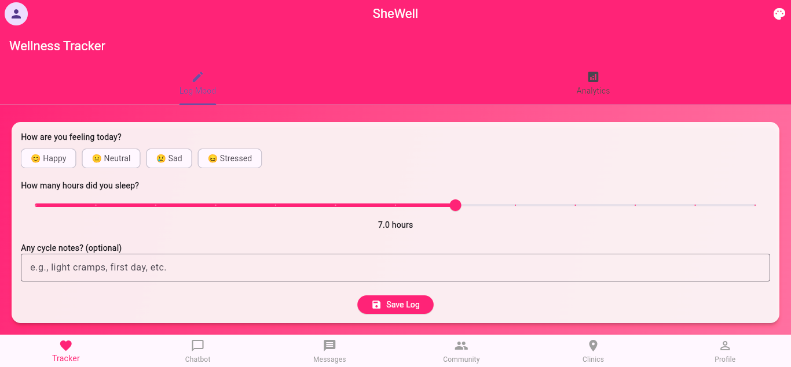
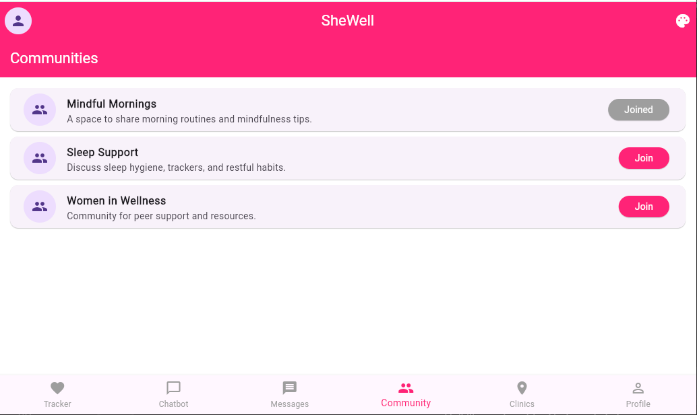
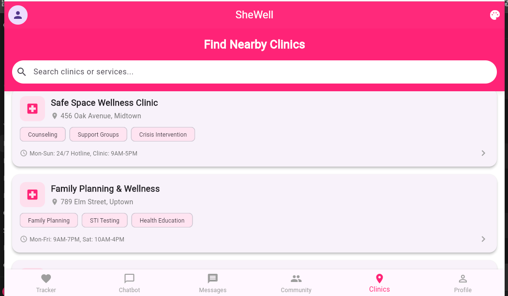
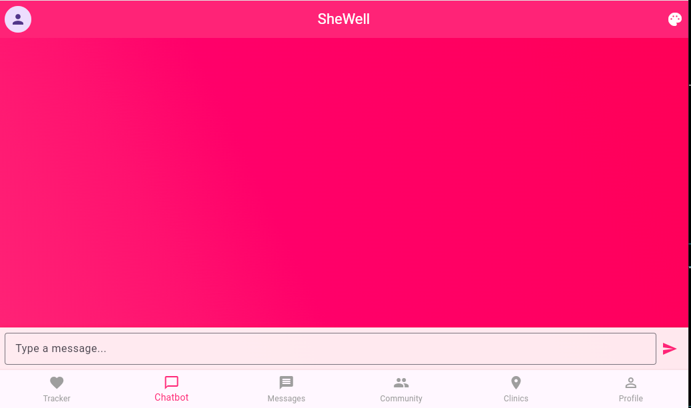

# SheWell App

SheWell is a cross-platform wellness and community application built with **Flutter** and **Supabase**. It empowers users to track their wellness, connect with a supportive community, locate clinics, and chat with an AI‑powered assistant.

---

## 🚀 Features

### 🔐 Authentication & Profiles

* Secure sign-up, login, and password reset via Supabase Auth
* Editable profile (avatar, username, theme preference)

### 🧘 Wellness Tracking

* Log moods, sleep hours, symptoms, and cycle info
* Visual wellness analytics

### 🏡 Community

* View and interact with posts
* Comment, like, and engage

### 🏥 Clinic Finder

* Search clinics and browse available services

### 🤖 AI Chatbot

* Gemini-powered AI assistant for wellness support

### 🖼 Cross‑Platform Support

* Android, iOS, Web, Windows, MacOS, Linux

---

## Demo screens (Web Version)
## 📸 Screenshots

Below are sample screenshots. Replace them with your actual images.

### **Home Screen**



### **Sign Up**


### **Community Feed**



### **Clinic Finder**



### **AI Chatbot**



> Place your screenshots inside a `/screenshots` folder for consistency.

---

## 🛠️ Getting Started

### Prerequisites

* Flutter SDK
* Dart SDK
* Supabase project
* (Optional) Google Gemini API key

### Setup Instructions

1. **Clone the repository:**

```sh
git clone <your-repo-url>
cd shewell_app
```

2. **Install dependencies:**

```sh
flutter pub get
```

3. **Configure environment variables:**
   Create or update `lib/secrets.dart`:

```dart
const String SUPABASE_URL = "your-supabase-url";
const String SUPABASE_ANON_KEY = "your-anon-key";
const String GEMINI_API_KEY = "your-gemini-key"; // optional
```

4. **Run the app:**

```sh
flutter run -d chrome
flutter run -d android
flutter run -d ios
flutter run -d windows
flutter run -d macos
flutter run -d linux
```

---

## 🗄️ Supabase Setup

Recommended tables:

* `users`
* `wellness_logs`
* `community_posts`
* `community_comments`
* `clinic_list`

Enable RLS and create policies for authenticated access.
Add storage buckets for profile images and community uploads.

---

## 🤖 Google Gemini Setup (Optional)

1. Generate an API key from Google AI Studio.
2. Add it to `lib/secrets.dart` or environment variables.

---

## 📁 Folder Structure

```
lib/
  main.dart
  secrets.dart
  models/
  screens/
  services/
  widgets/
assets/
  images/
  icons/
screenshots/
  home.png
  mood_tracker.png
  community.png
  clinics.png
  chatbot.png
```

---

## 🤝 Contributing

Pull requests are welcome. For major changes, open an issue first.

---

## 📄 License

MIT License

---

## 📬 Contact

For support, open an issue or contact the maintainer.
